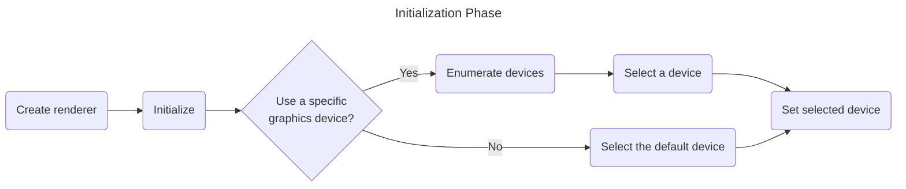
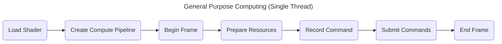
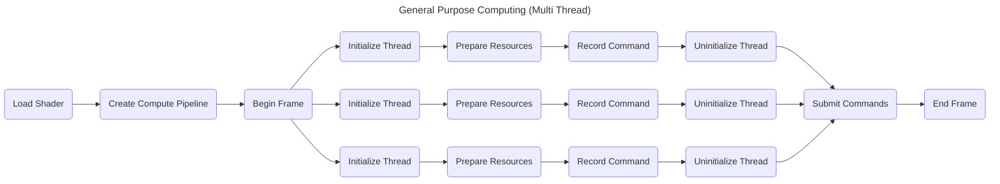

# HephGL

- [Introduction](#introduction)
- [Setup](#setup)
    - [Install](#install)
    - [Dependencies](#dependencies)
- [Usage](#usage)
    - [Running Examples](#running-examples)
    - [Running Tests](#running-tests)
    - [Renderer](#renderer)
    - [Graphics](#graphics)
- [Examples](examples/)
- [Documentation](https://docs.rs/heph-gl/0.1.0/heph_gl/)
- [Contributing](#contributing)
- [License](#license)


## Introduction

HephGL is an experimental cross-platform graphics library created for the sole purpose of me
learning Rust and graphics programming.

Goals:

- Multiple graphics backends (e.g., Vulkan, DirectX) with runtime backend switching.
- Clean, simple, low boilerplate, and easy to use API that is agnostic to the used backend.
- Thread-safe design.
- High performance and low memory consumption.
- Seamless integration with any windowing library.

## Setup

### Install

If you want to use HephGL in your project, run the following command
```bash
cargo add heph-gl
```

or add `heph-gl = <version>` to your `Cargo.toml`.

If you want to work on HephGL, simply clone this repository.

### Dependencies

clippy
```bash
rustup component add clippy
```

HephGL uses `nightly` for formatting
```bash
rustup toolchain install nightly --component rustfmt
```

HephGL uses `nextest` for integration tests since running them with standard `cargo test` results
in failure due to window creation in worker threads.
```bash
cargo install cargo-nextest --locked
```

All other dependencies are stated in the `Cargo.toml` file, and will be fetched automatically
during build.

## Usage

### Running Examples

Running an example using the default backend (Vulkan)
```bash
cargo run --example <example_name>
```

Running an example using a specific backend
```bash
cargo run --example <example_name> --no-default-features --features <backend_name>
```

Backends:
- vulkan
- directx
- metal
- opengl

> [!NOTE]
> Currently only Vulkan is supported.

### Running Tests

Running the integration tests
```bash
cargo nextest run
```

### Renderer

The `Renderer` trait provides a clean and simple API that is agnostic to the backend it uses.  This
enables us to switch between graphics APIs without changing the code. Renderers must be initialized
before we can start utilizing them.



After the initialization phase, we can use the graphics device to do computations, video
decoding/encoding, and graphics rendering. Flowcharts of these operations are given below. Check
the [examples](examples/) directory for code implementations.


You can use the "compute pipeline" for performing general purpose computations in the GPU. You can
use this to compute physics in a game, or multiply matrices. HephGL will utilize the dedicated
computation hardware whenever possible, and will fallback to general purpose GPU hardware if a
dedicated hardware is not available.




> [!NOTE]
> The remaining operations are not implemented yet, thus no flowcharts.

### Graphics

While the `Renderer` trait successfully abstracts the underlying backend, using it directly still
requires a fair amount of boilerplate for pipeline creation, resource management, command
recording, and multithreaded synchronization. The `Graphics` struct aims to provide a higher-level,
simplified API that allows you to easily render sprites or execute computations without writing all
of this boilerplate code.

You might wonder why the `Renderer` is still exposed directly if the `Graphics` struct is easier to
use. The `Graphics` struct is ideal for rapid development and applications that are not strictly
performance-critical. However, by retaining direct access to the `Renderer`, HephGL ensures that
developers can bypass the higher-level abstractions to fine-tune and optimize the rendering
pipeline specifically for their use cases.

> [!NOTE]
> The `Graphics` struct is not implemented yet.

## Contributing

All types of contributions are welcome. Feel free to open a PR, issue, or discussion.

HephGL uses `prek` for code formatting and linting. Follow the steps below to setup `prek`.

First install `prek`
```bash
cargo install prek --locked
```

To automatically run the required checks before every commit, install the pre-commit hook. Run this
command at the root of the repository
```bash
prek install
```

You can also run `prek` manually if you don't want to install the hook
```bash
prek
```

## License

Licensed under the BSD-3-Clause License.
